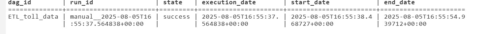

# ETL Toll Data Pipeline – Apache Airflow

This project is a hands-on lab assignment for building an ETL pipeline using Apache Airflow's BashOperator.

## 📘 Project Scenario

You are a data engineer at a data analytics consulting company. You have been assigned a project to decongest the national highways by analyzing road traffic data from various toll plazas. Each highway is operated by a different toll operator with a different IT setup, resulting in multiple file formats. Your job is to collect the data available in different formats and consolidate it into a single file.

---

## 🎯 Project Objectives

In this assignment, you will develop an Apache Airflow DAG that will:

- Extract data from a CSV file
- Extract data from a TSV file
- Extract data from a fixed-width text file
- Transform the extracted data
- Load the transformed data into a staging area

## 🛠 Technologies Used
- Apache Airflow
- Bash
- Python (for orchestration)
- CLI / Web UI

## 📋 Tasks Performed
- Extract from CSV, TSV, and fixed-width files
- Consolidate and transform data
- Load into a staging area
- Schedule and run DAG using Airflow

## 📸 Screenshots

## 🚀 How to Run
- Copy `ETL_toll_data.py` to your Airflow DAGs folder
- Start Airflow webserver and scheduler
- Trigger DAG from UI or CLI

